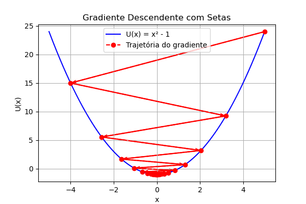
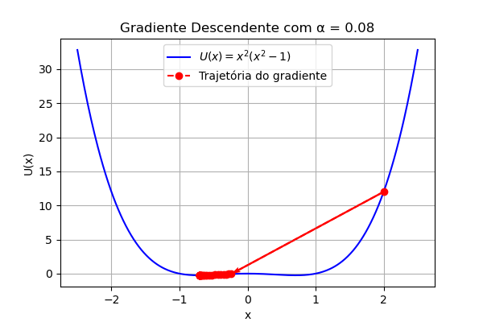
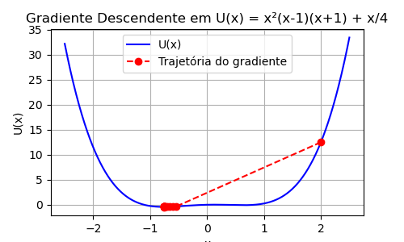
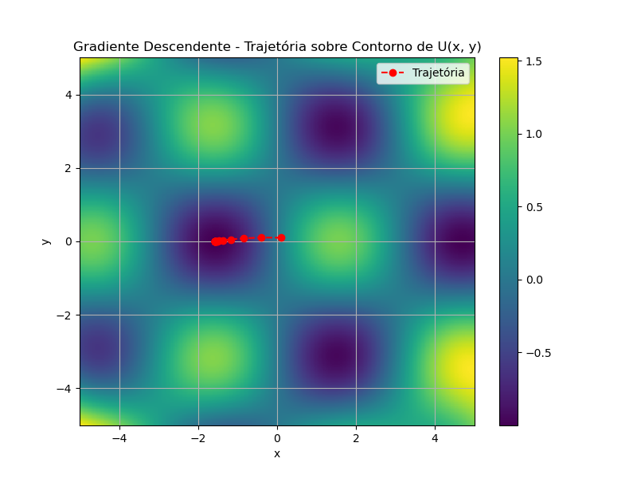
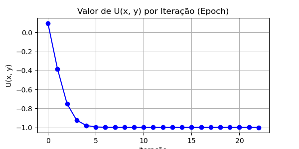
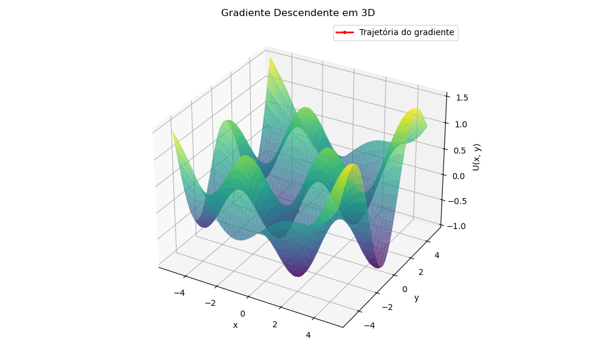

# Atividade 1: Otimização com Gradiente Descendente

## Resumo

Este trabalho explora o algoritmo de otimização **Gradiente Descendente**, uma técnica fundamental em aprendizado de máquina e física computacional utilizada para encontrar os pontos de mínimo de uma função. Através de uma série de exercícios, o comportamento do algoritmo é investigado em funções de uma e duas dimensões, analisando o impacto de parâmetros cruciais como a **taxa de aprendizado (𝛼)** e a **posição inicial**.

---

### Exercício 1: Minimizando uma Função Quadrática Simples

O primeiro exercício consiste em implementar o algoritmo de Gradiente Descendente para encontrar o mínimo da função convexa $U(x) = x^2 - 1$. A implementação parte de uma posição inicial $x_0 = 5$ e utiliza uma taxa de aprendizado $\alpha = 0.1$. O objetivo é visualizar a trajetória da otimização e entender o efeito dos seus parâmetros.

**Resultado:**

**Análise:**
A trajetória do algoritmo para encontrar o mínimo de uma função simples demonstra visualmente o funcionamento do Gradiente Descendente. Partindo de $x_0=5$, cada passo é dado na direção oposta ao gradiente. O tamanho do passo, definido pela taxa de aprendizado $\alpha$, é crucial. Um valor de $\alpha$ relativamente alto, como o visto no gráfico, pode causar um "overshoot", onde o algoritmo ultrapassa o ponto de mínimo e oscila ao redor dele antes de convergir. A variação deste parâmetro revela um trade-off fundamental: taxas de aprendizado menores garantem estabilidade, mas exigem mais iterações, enquanto taxas maiores podem acelerar a convergência, mas correm o risco de instabilidade ou divergência.

---

### Exercício 2: Mínimos Locais em um Potencial de Duplo Poço

Nesta etapa, o algoritmo foi aplicado à função $U(x) = x^2(x-1)(x+1)$, que possui dois mínimos globais e simétricos. O objetivo foi investigar como a taxa de aprendizado e o ponto inicial afetam a convergência em uma paisagem não convexa, partindo de $x_0 = 2$.

**Resultado:**

**Análise:**
A taxa de aprendizado afeta a trajetória e para qual mínimo o gradiente descendente vai. Taxas pequenas garantem estabilidade, mas demoram mais. Taxas grandes podem causar salto sobre os mínimos, oscilações ou divergência.

---

### Exercício 3: Efeito de Assimetria no Potencial

O exercício anterior foi modificado somando um termo linear, resultando na função $U(x) = x^2(x-1)(x+1) + x/4$. Esse termo quebra a simetria dos mínimos, tornando um deles globalmente mais baixo que o outro.

**Resultado:**

**Análise:**
Ao aumentar o valor de 𝛼, pode acontecer *overshooting*, onde os passos passam direto do mínimo e o algoritmo nunca converge. Ele pode começar a oscilar entre os dois lados de um vale. Se o valor for grande demais, o algoritmo pode divergir completamente. Ao diminuir 𝛼, os passos são menores, então o algoritmo leva mais tempo para chegar a um mínimo, porém, a trajetória se torna mais estável e confiável.

---

### Exercício 4: Gradiente Descendente em Duas Dimensões

O último exercício estendeu a análise para a função de duas variáveis, $U(x,y) = \sin(x)\cos(y) + 2(xy)^2/1000$, que possui múltiplos mínimos locais. A convergência foi acompanhada através de um mapa de contornos e um gráfico do valor da função por iteração.

**Resultados:**

**Análise:**
Taxas de aprendizado muito altas podem causar divergência ou saltos que impedem a convergência. Taxas muito pequenas tornam o aprendizado estável, mas lento. Devido aos múltiplos mínimos locais, a posição inicial influencia fortemente para onde o algoritmo converge.

---

### Conclusão Geral

A atividade demonstrou de forma prática as propriedades e limitações do algoritmo de Gradiente Descendente. Concluímos que sua eficácia depende criticamente da sintonização de hiperparâmetros, especialmente a **taxa de aprendizado**, que controla o balanço entre velocidade e estabilidade da convergência. Além disso, ficou evidente que, para funções não convexas, a **posição inicial** é um fator determinante para o resultado, uma vez que o algoritmo tende a convergir para o mínimo local mais próximo, sem garantia de encontrar o mínimo global.