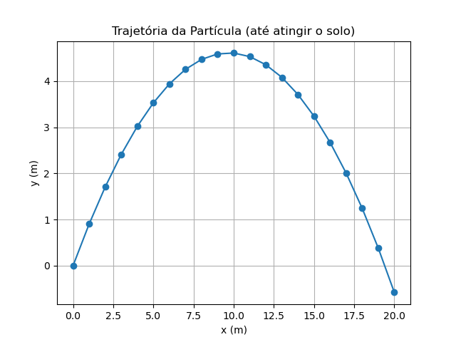

# Atividade 2: Simulação de Partícula com Orientação a Objetos


## 1. Objetivo

O objetivo desta atividade é aplicar os conceitos de programação orientada a objetos em Python para modelar um sistema físico. Foi desenvolvida uma classe chamada `Particula` para representar um objeto em um espaço bidimensional, e um script para simular sua trajetória sob a ação de uma força constante, especificamente um lançamento oblíquo sob gravidade.

---

## 2. Estrutura do Projeto

O código foi organizado nos seguintes arquivos, conforme as boas práticas de desenvolvimento:

* `particula.py`: Contém a definição da classe `Particula`, que encapsula os atributos e comportamentos de um ponto material.
* `exemplo_1.py`: Script principal que importa a classe `Particula`, instancia um objeto e executa a simulação do lançamento oblíquo.
* `README.md`: Este documento, contendo a descrição do projeto, a análise dos resultados e as instruções de uso.

---

## 3. Implementação da Classe `Particula`

A classe `Particula` foi implementada para armazenar o estado de uma partícula e atualizar seu movimento de acordo com as leis da física.

### Atributos

* `x`, `y`: As coordenadas da posição da partícula no plano 2D.
* `vx`, `vy`: As componentes da velocidade da partícula.
* `massa`: A massa da partícula.

### Método `newton(self, fx, fy, dt)`

Este método é o coração da simulação. Ele aplica a Segunda Lei de Newton ($F=ma$) para atualizar o estado da partícula a cada intervalo de tempo `dt`. O método realiza os seguintes passos:
1.  Calcula a aceleração ($a_x, a_y$) dividindo a força aplicada pela massa da partícula.
2.  Atualiza a velocidade somando a contribuição da aceleração durante o intervalo `dt`.
3.  Atualiza a posição somando a contribuição da nova velocidade durante o intervalo `dt`.

---

## 4. Simulação: Lançamento Oblíquo

O script `exemplo_1.py` utiliza a classe `Particula` para simular um caso clássico de lançamento oblíquo.

### Condições Iniciais e Físicas

* **Partícula:** É criada na posição inicial $(0, 0)$ m, com velocidade inicial de $(10, 10)$ m/s e massa de $1.0$ kg.
* **Força:** A única força que atua sobre a partícula é a gravidade, representada por um vetor de força constante $(f_x, f_y) = (0, -9.8)$ N.
* **Simulação:** O movimento é simulado em intervalos de tempo discretos de $\Delta t = 0.1$ s. A simulação é interrompida assim que a partícula atinge ou ultrapassa o nível do solo (ou seja, quando $y \le 0$).

### Resultados

A trajetória completa da partícula, do lançamento até o impacto com o solo, é mostrada no gráfico abaixo.



### Análise

O gráfico exibe a **trajetória parabólica** esperada para um projétil sob a ação de uma força gravitacional constante. A simulação implementada com a classe `Particula` consegue reproduzir com sucesso as características do movimento: a partícula sobe até uma altura máxima enquanto sua velocidade vertical diminui, e em seguida desce, com a velocidade vertical aumentando em módulo, até atingir o solo. A velocidade horizontal permanece constante, uma vez que não há forças atuando na direção x, resultando na forma simétrica da parábola.

---

## 5. Como Executar o Código

1.  Certifique-se de que os arquivos `particula.py` e `exemplo_1.py` estão no mesmo diretório.
2.  Tenha o Python e a biblioteca `matplotlib` instalados no seu ambiente.
3.  Execute o script principal através do terminal:
    ```bash
    python exemplo_1.py
    ```
4.  O gráfico da trajetória será exibido ao final da execução.