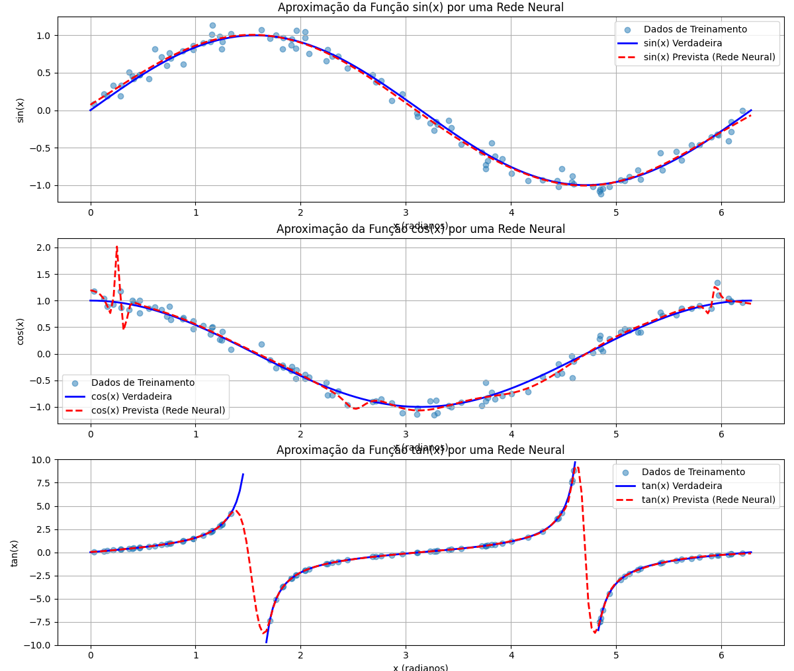

# Relatório da Atividade 3: Interpolação de Funções e Cálculo de Derivadas com Redes Neurais

## 1. Introdução

O objetivo desta atividade foi investigar a capacidade de redes neurais em duas tarefas distintas: a interpolação de funções matemáticas conhecidas e o aprendizado do cálculo de derivadas numéricas. Para tal, exploramos implementações utilizando as bibliotecas Scikit-learn e PyTorch, comparando suas abordagens e os resultados obtidos, com foco na precisão e nos desafios de generalização.

## 2. Metodologia

### 2.1. Ferramentas e Bibliotecas
- Python (versão utilizada no ambiente Conda, ex: 3.11)
- NumPy: Para manipulação numérica e geração de dados.
- Scikit-learn: Para implementação de Redes Neurais (`MLPRegressor`).
- PyTorch: Para implementação de Redes Neurais com arquiteturas customizadas, loops de treinamento explícitos e utilização de aceleração por GPU (NVIDIA CUDA).
- Matplotlib: Para visualização gráfica dos resultados.

### 2.2. Configurações Comuns dos Modelos
- **Função de Perda:** Erro Quadrático Médio (MSE).
- **Otimizador:** Adam.
- **Função de Ativação (Camadas Ocultas):** Tangente Hiperbólica (tanh).
- **Dados de Treinamento:**
    - Para interpolação: Pontos amostrados das funções alvo com adição de ruído gaussiano.
    - Para cálculo de derivadas: Pares de (polinômio aleatório, derivada analítica do polinômio), com os valores de ambos normalizados pelo máximo absoluto do polinômio original.

## 3. Implementação e Resultados: Interpolação de Funções

Redes neurais foram treinadas para interpolar: Seno, Cosseno, Tangente (0 a 2π), função sinc(x) (-10 a 10) e função Gaussiana e-x² (-5 a 5).

### 3.1. Implementação com Scikit-learn (`MLPRegressor`)
Utilizou-se o `MLPRegressor` com uma arquitetura de 3 camadas ocultas, cada uma com 10 neurônios.

**(Resultados Visuais - Scikit-learn)**
* **Seno, Cosseno, Tangente:**
    * 
    * *Comentário:* As interpolações para seno e cosseno foram precisas. Para a tangente, a remoção de valores próximos às assíntotas permitiu um bom ajuste nas regiões contínuas.
* **Função sinc(x):**
    * ![[img/img_sklearn_interpolação_função_sync(x).png]]
    * *Comentário:* A rede scikit-learn modelou bem as características da função sinc.
* **Função Gaussiana:**
    * ![[img_sklearn_interpolação_função_gaussiana.png]]
    * *Comentário:* A aproximação da função Gaussiana foi excelente.

### 3.2. Implementação com PyTorch
Uma classe `MLP` customizada foi definida, com arquitetura e hiperparâmetros similares aos do scikit-learn para permitir uma comparação direta.

**(Resultados Visuais - PyTorch)**
* **Seno, Cosseno, Tangente:**
    * ![[img_pytorch_interpolação_seno_coseno_tangente.png]]
    * *Comentário:* Os resultados do PyTorch para a interpolação dessas funções foram visualmente indistinguíveis dos obtidos com scikit-learn.
* **Função sinc(x):**
    * ![[img_pytorch_interpolação_função_sync(x).png]]
    * *Comentário:* A interpolação da função sinc com PyTorch também demonstrou alta fidelidade.
* **Função Gaussiana:**
    * ![[img_pytorch_interpolação_função_gaussiana.png]]
    * *Comentário:* A função Gaussiana foi igualmente bem interpolada pela rede PyTorch.

### 3.3. Comparativo (Interpolação)
Para as tarefas de interpolação, tanto o Scikit-learn quanto o PyTorch produziram resultados de alta qualidade e visualmente comparáveis com arquiteturas simples. O PyTorch introduz uma maior verbosidade na definição do modelo e do loop de treino, mas oferece flexibilidade que se torna mais vantajosa em problemas mais complexos.

## 4. Implementação e Resultados: Cálculo de Derivadas

Esta tarefa visou treinar uma rede para mapear uma função discretizada à sua derivada discretizada, utilizando polinômios para treinamento e testando a generalização em funções trigonométricas e x².

### 4.1. Implementação com Scikit-learn
Foi utilizado o `MLPRegressor` com uma arquitetura mais profunda (10 camadas ocultas com 10 neurônios cada).

**(Resultados Visuais - Scikit-learn - Derivadas)**
* **Teste com sin(πx), cos(πx), x²:**
    * ![[img_sklearn_derivadas.png]]
    * *Comentário:* A rede scikit-learn conseguiu aprender a tendência linear da derivada de x². Para as funções trigonométricas, houve uma tentativa de seguir a forma ondulatória, mas com erros significativos de fase e, principalmente, de amplitude (previsões "achatadas").

### 4.2. Implementação com PyTorch (com Otimizações e GPU)
Foi definida uma classe `MLP_Derivadas` customizada. O processo de treinamento foi iterativamente melhorado:
- Aumento do número de épocas para 20.000.
- Aumento da quantidade de dados de treinamento (30.000 funções polinomiais).
- Adoção de uma arquitetura de rede mais larga (ex: `[128, 256, 128] neurônios`).
- Uso de um agendador de taxa de aprendizado (`ReduceLROnPlateau`).
- Adição de regularização L2 (`weight_decay`).
- Aplicação de `gradient clipping`.
- Treinamento realizado em GPU (NVIDIA GeForce RTX 3050) para viabilizar os longos tempos de treinamento.

**(Resultados Visuais - PyTorch - Derivadas Otimizadas)**
* **Teste com sin(πx), cos(πx), x²:**
    * ![[img_pytorch_derivadas_v3.png]]
    * *Comentário:* As melhorias implementadas resultaram em um avanço substancial. A derivada de x² foi prevista com excelente precisão. Mais notavelmente, para as funções sin(πx) e cos(πx), as derivadas previstas agora acompanham muito bem a fase e, crucialmente, a **amplitude** das derivadas reais, embora pequenas discrepâncias e suavizações ainda existam.
* **Curvas de Perda e Taxa de Aprendizado:**
    * ![[img_pytorch_taxa_aprendizagem_derivadas_v3.png]]
    * *Comentário:* As curvas mostram uma diminuição consistente da perda de treino e teste (polinômios) para valores baixos (MSE ~0.001-0.002). A perda de teste acompanha de perto a de treino, indicando boa generalização dentro do domínio dos polinômios. O gráfico da taxa de aprendizado confirma a ativação do scheduler, que reduziu o LR, auxiliando na convergência fina do modelo.

### 4.3. Comparativo e Desafios (Cálculo de Derivadas)
A tarefa de aprender o operador de diferenciação é inerentemente mais complexa que a interpolação.
- A implementação inicial com Scikit-learn serviu como uma linha de base, mostrando dificuldades em generalizar para as funções trigonométricas, especialmente em amplitude.
- A abordagem com PyTorch, combinada com o uso de GPU e otimizações iterativas, demonstrou uma capacidade significativamente superior. A arquitetura mais larga e o treinamento extenso foram cruciais para que a rede aprendesse a gerar saídas com amplitudes corretas para as derivadas das funções trigonométricas.
- O principal desafio reside na generalização: treinar com uma classe de funções (polinômios) e esperar um bom desempenho em outra (trigonométricas). A normalização dos dados (dividir função e derivada pelo máximo absoluto da função original) é um ponto delicado que influencia a escala das saídas. Apesar das melhorias, uma precisão perfeita em funções muito diferentes das de treinamento ainda é um desafio.

## 5. Discussão sobre Parâmetros e Overfitting

A experimentação revelou a importância dos hiperparâmetros:
- **Arquitetura da Rede:** Para as derivadas, uma rede mais larga (maior número de neurônios por camada) foi mais eficaz do que a rede profunda e estreita testada inicialmente, especialmente para capturar a amplitude correta das derivadas.
- **Taxa de Aprendizado e Épocas:** Otimizadores adaptativos (Adam) e agendadores de taxa de aprendizado (`ReduceLROnPlateau`) foram fundamentais para o treinamento longo (20.000 épocas) necessário para a tarefa de derivadas. O uso de GPU tornou esse treinamento viável.
- **Quantidade de Dados:** Aumentar o número de exemplos de polinômios (de 10.000 para 30.000) contribuiu para uma melhor generalização.
- **Regularização:** `Weight decay` (L2) foi adicionado para ajudar a prevenir o overfitting em modelos maiores. As curvas de perda (teste acompanhando treino) sugerem que o overfitting massivo foi evitado para o conjunto de validação de polinômios.
- **Generalização vs. Overfitting:** O desafio maior não foi tanto o overfitting aos polinômios de treino, mas sim a capacidade de generalizar o "conceito" de derivada para funções estruturalmente diferentes.

## 6. Conclusão

A atividade demonstrou com sucesso que redes neurais podem interpolar funções conhecidas com alta precisão usando tanto Scikit-learn quanto PyTorch. No entanto, a tarefa de ensinar uma rede a calcular derivadas de forma generalizada é substancialmente mais complexa.
A flexibilidade do PyTorch, permitindo o ajuste fino da arquitetura, do loop de treinamento, e a utilização de GPU, foi crucial para alcançar uma melhora significativa na previsão das derivadas de funções trigonométricas, superando as limitações observadas com a abordagem mais simples do Scikit-learn para este problema específico. Os resultados finais, embora não perfeitos, mostram que a rede neural foi capaz de aprender uma aproximação notável do operador de diferenciação para as funções testadas, especialmente após otimizações consideráveis.

---
