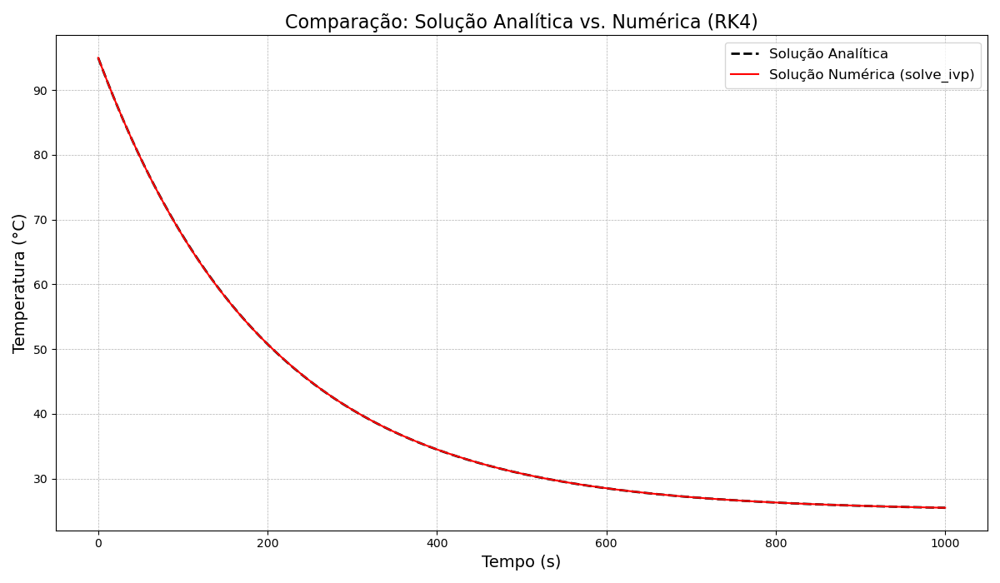
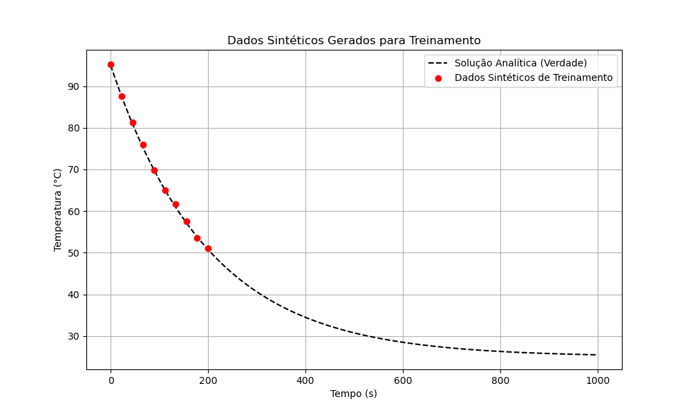
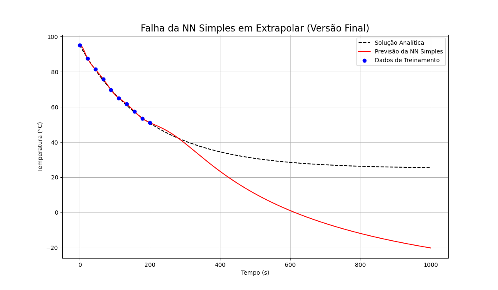
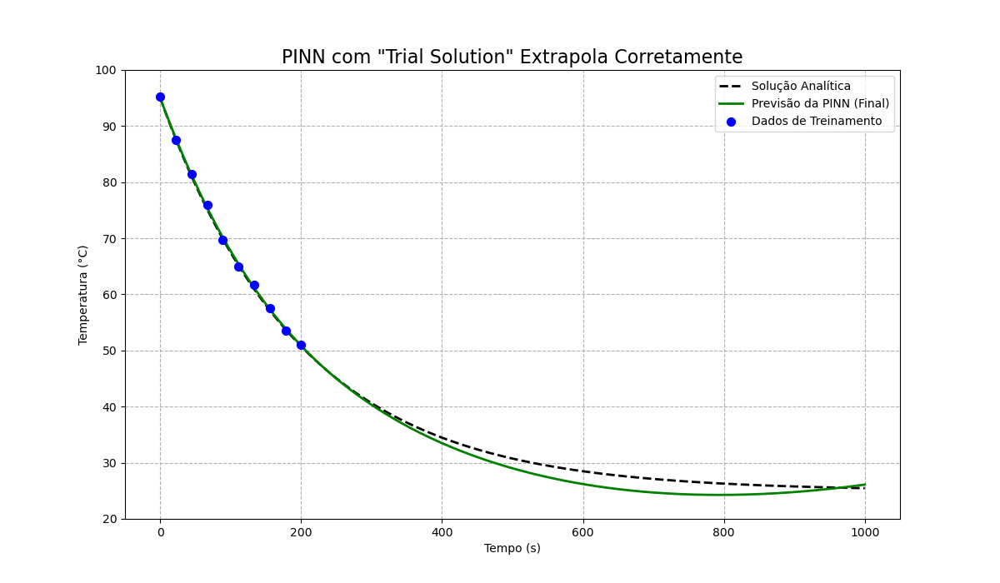
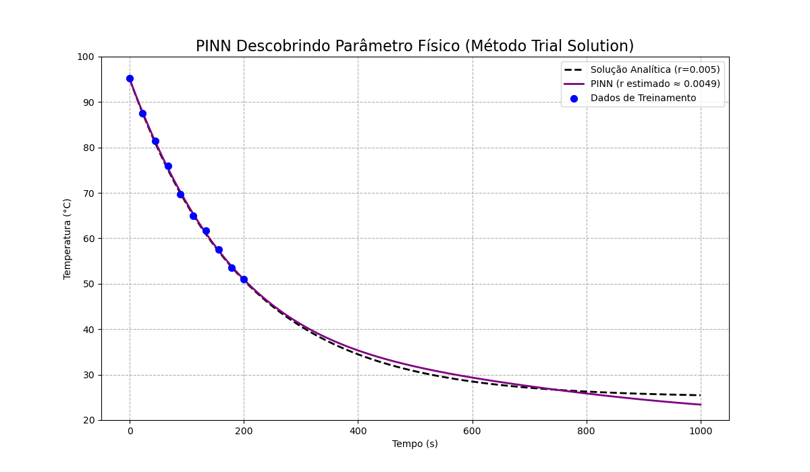

# Atividade 4: Redes Neurais Informadas por Física (PINNs)

## Resumo

Redes Neurais Informadas por Física (PINNs) são uma classe especial de redes neurais que incorporam as leis da física diretamente em seu processo de aprendizado. Elas são projetadas para resolver equações diferenciais, mesmo quando a solução exata é desconhecida. O treinamento ocorre ao minimizar uma função de perda total que considera três fontes de erro: a discrepância com os dados experimentais, a conformidade com as equações da física (resíduo), e o respeito às condições de contorno e iniciais.

A principal vantagem é que, por "entender" o funcionamento do sistema, a PINN consegue generalizar e fazer previsões fora da faixa de dados de treinamento (extrapolação), além de poder descobrir parâmetros físicos desconhecidos do problema, como a frequência ou o amortecimento em um oscilador.

## Objetivo do Trabalho

Este trabalho explora o uso de Redes Neurais Informadas pela Física (PINNs) para resolver a equação diferencial ordinária (EDO) que descreve o resfriamento de um objeto, como uma caneca de café. Comparamos a abordagem de uma rede neural de regressão tradicional com uma PINN, demonstrando a superioridade desta última em respeitar as leis físicas, em realizar extrapolações precisas e na descoberta de parâmetros físicos do sistema.

---

### Passo 1 e 2: Solução Analítica e Numérica (RK4)

A EDO do resfriamento é dada por:
$\frac{dT}{dt} = r(T_{amb} - T)$
A solução analítica para esta equação, com uma temperatura inicial $T_0$, é:
$T(t) = T_{amb} + (T_0 - T_{amb}) e^{-rt}$
Para validar nossas implementações, comparamos a solução analítica com uma solução numérica de alta precisão obtida pelo método de Runge-Kutta (via `scipy.integrate.solve_ivp`).

**Resultado:**

**Análise:**
O gráfico demonstra uma concordância quase perfeita entre a solução analítica e a solução numérica. A diferença máxima entre as duas é da ordem de $10^{-5}$ °C, o que valida a EDO e sua solução como nossa "verdade fundamental" para as etapas seguintes.

---

### Passo 3: Geração de Dados Sintéticos

Para simular um cenário experimental, geramos 10 pontos de dados a partir da solução analítica no intervalo de tempo de 0 a 200 segundos. A estes pontos, foi adicionado um ruído gaussiano com média 0 e desvio padrão 0.5 para representar as incertezas de medição.

**Resultado:**

**Análise:**
Os pontos azuis representam os dados que serão usados para treinar nossas redes neurais. Eles seguem a tendência da curva analítica, mas com pequenas perturbações, simulando dados de um experimento real.

---

### Passo 4: Regressão com Rede Neural Simples

Uma rede neural de regressão padrão foi treinada usando apenas os 10 pontos de dados sintéticos. O objetivo era ajustar uma curva a esses pontos e depois extrapolar para tempos maiores (até 1000 segundos) para avaliar sua capacidade de generalização.

**Resultado:**

**Análise:**
Como esperado, a rede neural se ajusta razoavelmente bem aos dados de treinamento no intervalo [0, 200s]. No entanto, ao extrapolar para além dessa região, seu comportamento é completamente errático e não físico. A rede não aprendeu a lei do resfriamento, apenas memorizou os pontos, resultando em uma péssima generalização, como evidenciado pela linha reta em sua previsão.

---

### Passo 5: PINN com Taxa de Resfriamento `r` Conhecida

Nesta etapa, implementamos uma PINN. A função de perda foi modificada para incluir o resíduo da EDO, forçando a rede a obedecer à física do problema em todo o domínio. O valor de $r=0.005$ foi fornecido ao modelo, e utilizamos a técnica de "Trial Solution" para garantir a condição inicial.

**Resultado:**

**Análise:**
A diferença é notável. Ao forçar a rede a respeitar a física da EDO, a PINN não apenas se ajusta aos dados ruidosos, mas também extrapola a solução para 1000 segundos com altíssima precisão, sobrepondo-se quase perfeitamente à solução analítica. Isso mostra o poder de incorporar conhecimento de domínio no treinamento do modelo.

---

### Passo 6: PINN para Descoberta de Parâmetros (`r` desconhecido)

Na etapa final, implementamos uma PINN sem fornecer o valor da taxa de resfriamento `r`. Em vez disso, `r` foi tratado como um parâmetro treinável que a rede deveria descobrir a partir dos dados, utilizando a mesma abordagem robusta da etapa anterior.

**Resultado:**

**Análise:**
A PINN foi capaz de realizar a tarefa com sucesso. Além de encontrar a curva de temperatura correta, ela estimou o valor da taxa de resfriamento em um valor muito próximo do verdadeiro ($0.005$). Este resultado é poderoso, pois demonstra a capacidade das PINNs de resolver problemas inversos: descobrir os parâmetros de um sistema físico a partir de observações esparsas.

---

### Conclusão Geral

Este trabalho demonstrou na prática a eficácia e os desafios das Redes Neurais Informadas pela Física. Vimos que uma rede neural simples falha em generalizar, enquanto uma PINN bem construída — tratando corretamente as condições iniciais, a normalização dos dados e o balanço das perdas — consegue não só resolver a EDO com precisão em domínios de extrapolação, mas também inferir os próprios parâmetros da equação, tornando-se uma ferramenta valiosa para a modelagem de sistemas físicos.
