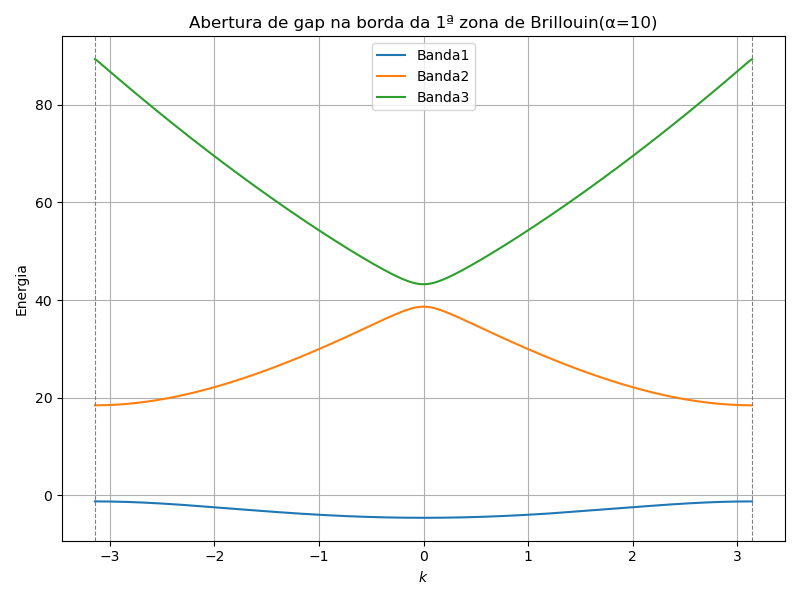

# Estrutura de Bandas 1D com Expansão em Ondas Planas

Este projeto simula a estrutura de bandas de um elétron livre sujeito a um potencial periódico unidimensional. Utiliza-se a **expansão da função de Bloch em ondas planas**, um método fundamental na física do estado sólido para resolver a equação de Schrödinger com simetria translacional.

---

## Contexto Físico

Segundo o teorema de Bloch, a função de onda de um elétron em um potencial periódico $V(x + R) = V(x)$ pode ser escrita como: $\psi_k(x) = e^{ikx} u_k(x)\$, com $u_k(x)$ sendo uma função periódica com o mesmo período do potencial. Expandindo $u_k(x)$ em uma base de ondas planas:

$u_k(x) = \sum_G c(k-G) e^{iGx}$

Substituindo essa forma na equação de Schrödinger, obtemos uma equação matricial para os coeficientes $c(k-G)$, cuja diagonalização fornece as **bandas de energia** $E_n(k)$.

Neste projeto, considera-se um potencial periódico do tipo:

$V(x) = \sum_G V_G e^{iGx}, \quad \text{com } V_G = \alpha \text{ constante}$

---

## Implementação Numérica

A Hamiltoniana resultante é tridiagonal no espaço de Fourier se considerarmos apenas os termos $V_{\pm G}$ mais próximos (potencial de Fourier truncado). A matriz montada para cada valor de $k$ é:

$H_{mn}(k) = \delta_{mn}(k - G_n)^2 + V_{|G_m - G_n|}$

- Os termos diagonais representam a energia cinética modificada por $k$.
- Os termos fora da diagonal são constantes $\alpha$, representando o acoplamento entre modos.

A diagonalização da matriz é feita eficientemente com `scipy.linalg.eigh_tridiagonal`.

---

## Organização do Código

- `alpha`: intensidade do potencial periódico.
- `N_G`: número de vetores de onda $G = 2\pi n$, com $n \in [-N_G, N_G]$.
- `k_points`: malha de valores do vetor de onda $k \in [-\pi, \pi]$.
- `bands`: matriz de autovalores (energias) para cada valor de $k$.

---

## Saída: Estrutura de Bandas

O script plota as três primeiras bandas de energia em função do vetor de onda \( k \), ilustrando a **abertura de gaps de energia na borda da zona de Brillouin**.

- O gap é proporcional ao valor de `alpha`.
- Os autovalores são calculados para cada valor de $k$ , formando as curvas $E_n(k)$.

